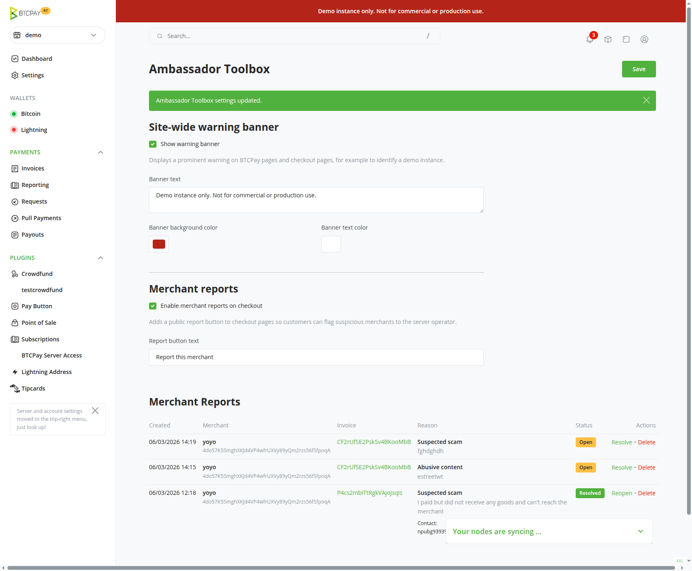
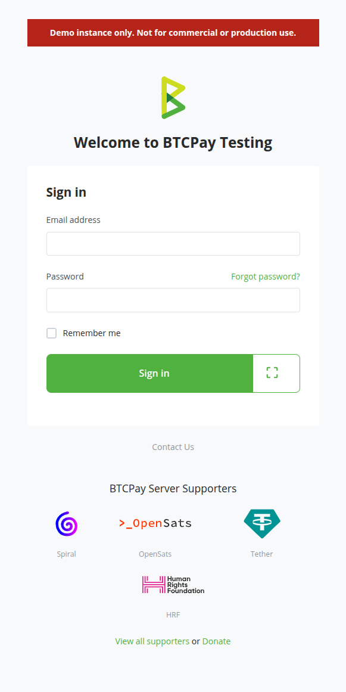
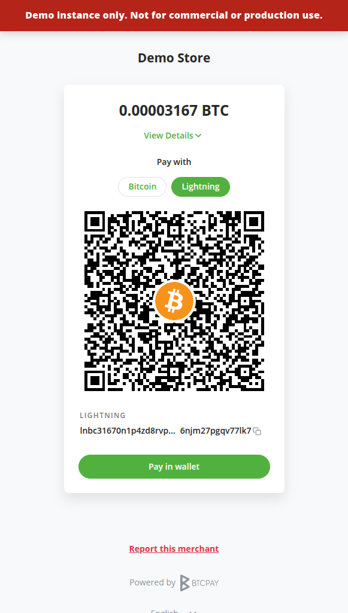
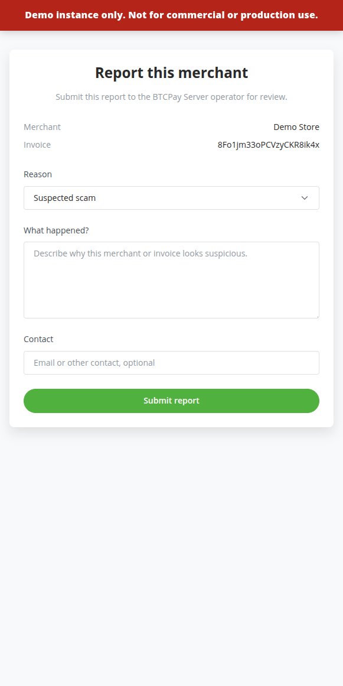

# Ambassador Toolbox

Ambassador Toolbox is a server-level BTCPay Server plugin for operators who host merchants or run public/demo instances. It adds tools that help communicate instance status and collect merchant abuse reports from checkout pages.

The first tools are a configurable warning banner and a public merchant report workflow.

## Requirements

- BTCPay Server `>= 2.4.0`.
- Server administrator access.
- Permission to modify server settings.


## Warning Banner

The warning banner is intended for situations where the operator needs to make the status of the instance obvious, for example:

- Demo instances.
- Training instances.
- Test environments.
- Hosted merchant platforms with required operator messaging.

When enabled, the banner is injected into the main BTCPay layout and checkout pages. Checkout pages include a JavaScript implementation and a `noscript` fallback so the warning remains visible when JavaScript is unavailable.

Default banner text:

```text
Demo instance only. Not for commercial or production use.
```

## Merchant Reports

Merchant reports allow customers or external users to flag a checkout/invoice for operator review.

When merchant reports are enabled:

1. Checkout pages show a configurable report link.
2. The link opens a public report form for the current invoice.
3. The reporter enters a reason, details, and optional contact information.
4. The report is stored in the plugin settings.
5. BTCPay sends an admin notification.
6. Server administrators can review reports from the Ambassador Toolbox page.

Reports can be resolved, reopened, or deleted from the admin UI.

## Settings
You can find the settings under Server Settings > Ambassador Toolbox.

## Limitations

- Reports are stored in BTCPay settings, not in a dedicated database table.
- The plugin collects reports for operator review; it does not enforce merchant takedowns or automate abuse decisions.
- The public report form is available only when merchant reports are enabled and the invoice exists.
- The warning banner appears only while the plugin is installed and enabled.

## Screenshots

### Site-wide backend banner

The banner is shown across the authenticated BTCPay merchant and server UI so operators can make demo, testing, or hosted-platform notices visible before users interact with stores.



### Login page banner

The same warning can be shown on unauthenticated pages such as login and registration.



### Checkout banner and report link

Checkout pages can show the operator warning banner and a public report link for customers who need to flag a suspicious merchant or invoice.



### Merchant report form

The public report form captures the merchant, invoice, report reason, details, and optional contact information for administrator review.


